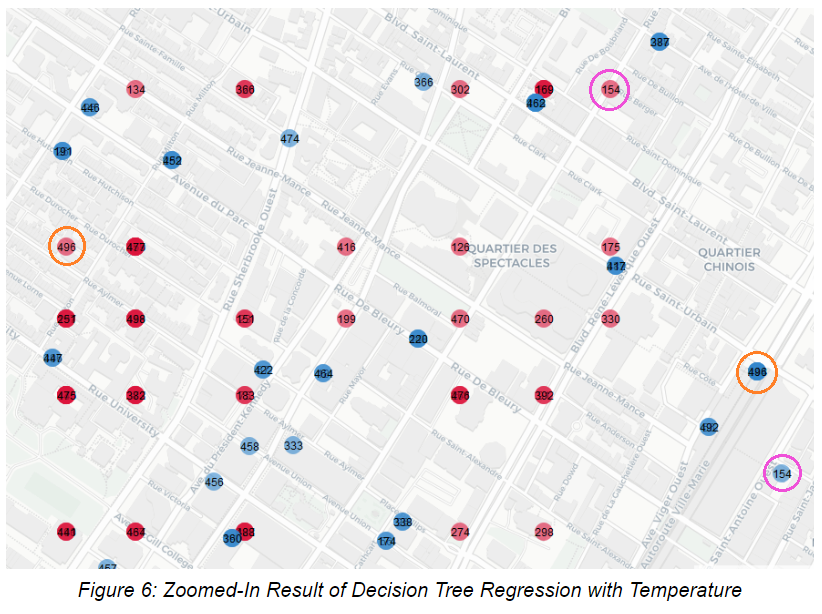

# SOEN 499 Project: Predicting Trip Destinations with BIXI Data

    <strong>Prepared By:</strong> 
    Krishna Patel 40031019 
    Manpreet Singh 27517378 
    Derek Yu 40022110 

## Abstract

This project aims to study the dataset provided by the Montreal bike share company, BIXI. In this analysis, the trip histories of commuters from 2014 to 2019 will be studied to try and predict where these commuters are likely to end their trips. Information of their starting point, the time of day/week/year, as well as the weather, will be used to make these predictions. Achieving this will reveal insights into the patterns of movements from different areas of the city, and thus adjustments can be made to better improve availability for this mode of alternative transport during times of high demand.

---

## Introduction

As the growing number of inhabitants have started to put a strain on the transportation networks of major cities, many have turned to alternative modes of transportation to fulfill their needs of getting around. This includes popular offerings such as dockless e-scooters and bike-sharing programs like BIXI in Montreal. One issue still remains however: matching the demand for bikes with availability. In order to improve on this issue, companies like BIXI need a way of understanding the traffic flows of their network (i.e. where do users start and end their trips, and at what times) so that they can make better accommodations to distribute their vehicles and docking stations at the appropriate times and therefore increase availability.

The objective of this project is to use BIXI’s past trip history data to attempt at making predictions on where a user is likely to end their trip, given a set of initial conditions. These can include the starting point of a user’s trip, the start time (within the day, the week, and the year), and even the weather at that particular time. With these predictions, forecasts can then, in theory, be made on the demand of bikes in different areas of the city, although this will not be the focus on this project.

The stated prediction problem will be implemented in two ways: first, as a multi-class classification problem (where each station or area is a class label), and second, as a regression problem where the coordinates of the user’s destination will be determined. The performance of both will be compared to see which type of predictor will yield better results. Additionally, each of these prediction techniques will be implemented with Decision Trees and with Random Forests to see which model has the better performance.

### Related Work

Currently, there are no related works that try to predict the end destinations of users in a bike-sharing network. However, there exists numerous works that explore bike-sharing datasets, works that try to classify the types of users in a bike-sharing system (e.g. casual commuter or subscribing member), and works that try predicting demand based on time.

Most notably, and most similar to this project, is an [analysis](https://towardsdatascience.com/understanding-bixi-commuters-an-analysis-of-montreals-bike-share-system-in-python-cb34de0e2304) done by Gregoire C.-M. who sought to reveal the habits of BIXI commuters using BIXI’s 2018 dataset. In this, he mainly tries to explore the provided dataset, but also attempts to correlate rider demand with daily temperature to make regression predictions with scikit-learn’s `LinearRegression` model. He concludes that there is indeed a correlation between increasing temperatures and ridership, but only up until a certain point where demand starts to decrease.

There are multiple other works that tackle the problem of predicting the demand of bike-sharing services. An extensive [paper](https://pdfs.semanticscholar.org/32f7/f3da38fe78fb5237aea70f343cc8c77af92b.pdf) produced by Arnab Kumar Datta details the performance of predicting bike-share usage with the Decision Tree, Random Forest and AdaBoost models. The conclusions of this paper reported favourable results for the Random Forest and AdaBoost techniques, which both had lower Root Mean Square Errors (RMSE) than that of the Decision Tree technique. Another [work](http://ijiset.com/vol2/v2s4/IJISET_V2_I4_195.pdf) by Patil, Musale and Rao, also used Decision Trees, Random Forests and Boosted Decision Tree algorithms to make predictions about bike-share demand. Similar to the previous paper mentioned, their results point towards Random Forests as a strong performer. Other works with a similar objective exist, but mainly employ other algorithms and techniques to build their regressors.

---

## Materials and Methods

### Dataset

The dataset under study is the BIXI trip history data from 2014 to 2019 taken from BIXI’s [open data portal](https://montreal.bixi.com/en/open-data). The files available on the website are composed of two types of CSVs: monthly trip history data of all the BIXI trips occuring in a given year, and BIXI stations information.

The monthly BIXI trip data CSVs are comprised of the following information:

-   **start_date** (the datetime of the moment a user has started a trip)
-   **start_station_code** (the ID of the BIXI station where the user has started the trip)
-   **end_date** (the datetime of the moment a user has ended a trip)
-   **end_station_code** (the ID of the BIXI station where the user has ended the trip)
-   **duration_sec** (the total duration of the trip in seconds)
-   **is_member** (boolean variable to identify whether the user is a member of the BIXI service)

The BIXI station CSV is comprised of the following information:

-   **code** (ID of the BIXI station)
-   **name** (name of the street/intersection where the BIXI station is located)
-   **latitude** (latitude of the BIXI station)
-   **longitude** (longitude of the BIXI station)

The size of the dataset totals to a count of 26,171,494.

A secondary dataset is used for the hourly weather data of Montreal from the [Government of Canada](https://climate.weather.gc.ca/climate_data/daily_data_e.html?StationID=51157). The only information pertinent for the purpose of this project are:

-   **Temp (°C)** (temperature at a specific hour)
-   **Weather** (string description of the weather conditions at a specific hour)

### Technologies

Apache Spark is used for the majority of this project, for both data preprocessing and machine learning. The latter is implemented with [Spark’s MLlib](https://spark.apache.org/mllib/), which provides scalable versions of many common machine learning algorithms.

To visualize the results of the predictions, this project also makes use of a Python data visualization library called [Folium](https://python-visualization.github.io/folium/). This package allows maps to be created easily, which is useful for verifying whether the distribution of predicted end stations matches that of the actual end stations.

### Data Preprocessing

As mentioned earlier, the yearly BIXI data provided consists of trip histories and stations. The two are combined so that the starting and end points of each individual trip are assigned a location in terms of coordinates. The stations listing may differ across the years (e.g. stations added/removed, station codes reassigned), but it is assumed that most station locations from year to year will remain the same. Therefore, to account for any disparities, the union of the sets of stations from every year is taken into consideration when making predictions.

Moreover, since this data is heavily based on time, the ‘start_date’ is broken down into individual usable features such as the starting hour, day of the week, and month. The hour feature is then encoded with sine and cosine functions to account for its cyclical nature (e.g. 11PM and 1AM should be 2 hours apart instead of 21 hours). A more in-depth explanation is provided [here](https://www.kaggle.com/avanwyk/encoding-cyclical-features-for-deep-learning).

To balance the data (in the case of classification), the majority classes are randomly undersampled to a specified ratio relative to the minority class.

### Algorithms

#### K-Means Clustering

The k-means clustering algorithm is used to group together BIXI stations into different representative areas of the city, with the stations’ latitude and longitude being used as features. These clusters are then used to represent the class labels when predicting a trip’s end point with the classifiers, as well as representing the trip’s starting point. For this project, this algorithm uses K = 10, as any more clusters yield little to no improvement and any less results in incohesive groupings.

#### Decision Tree

Spark provides two APIs for classification and regression: `DecisionTreeClassifier` and `DecisionTreeRegressor`.

For the classifier, the trip’s start station name (or eventually, the start cluster), month, day of the week and encoded hour of the day are features used to predict the trip’s end cluster. The hourly temperature is also later added to see whether it would help improve the predictions. To evaluate the classifier’s performance, the `MulticlassClassificationEvaluator` class is used to measure accuracy, recall, precision and F1-score.

For regression, two individual regressors are built to predict the end latitude and the end longitude with the starting latitude/longitude, the month, the day of the week, and the encoded hour of the day as features. Likewise, the hourly temperature is later used as well in a seperate run of the model training. The RMSE of each predicted value is then used to evaluate the performance.

#### Random Forest

Similar to Decision Trees, Spark offers two APIs for classification and regression: `RandomForestClassifier` and `RandomForestRegressor`. Building and evaluating the models will involve the same process as with the Decision Trees, except that an ensemble of 20 trees will be used to make predictions instead. It is expected that the Random Forest model will outperform the Decision Tree due to its tolerance to overfitting and its tendency to be more reliable and accurate than a single tree.

---

## Results

In every run of the model training, the dataset was split into an 80% training and 20% test set. However, due to the limitations of hardware, only the data for 2018 and 2019 were used to produce the analysis. The runtime of the algorithms differed significantly. For example, the runtime to train the Decision Tree classifier was around 2 hours on local hardware, while the Random Forest classifier took about 6 to 8 hours. This is in contrast to the regressors, which took about 30-45 minutes to train a Decision Tree and about 45-60 minutes for the Random Forest with the same hardware configuration.

### Classifiers

The following picture illustrates the clusters of bike stations used for classification:

  

A total of four versions were run when training the classifiers (both for Decision Tree and Random Forest). The differences between versions is listed below in the table, along with the accuracies of each algorithm.

  

\* Included in all versions: month, day of the week, hour (sin), hour (cos)

 

  

Tables 2 to 5 list the accuracy, precision, recall, and F1-Score metrics for each version.

  

Tables 6 and 7 show the evolution of the performance of the Decision Tree and the Random Forest classifiers side-by-side.

### Regressors

Training the regressors also involved multiple versions, in this case only two. Table 8 below shows the difference between each version.

  

\* Included in all versions: starting lat., starting long., month, day of the week, hour (sin), hour (cos)

  

In Table 9 to 10, Version 1 and 2 results have been listed for both the Decision Tree and the Random Forest. Regression was performed on both the end latitude and the end longitude separately, each with their own RMSE.

To see the results of the regression more tangibly, the maps below provide a visual representation of the generated predictions, where the actual end station location is marked by a blue circle, while the predicted location is marked by a red circle.

  

---

## Discussion

### Classifiers

Comparing Version 1 and 2 of the classifiers, there is a very noticeable increase in performance for both the Decision Tree and the Random Forest. The addition of clustering is the primary reason for this. With clustering, the total number of classes in the dataset is reduced from 754  to 10, the number of clusters. This means that the training data becomes less sparse, as the number of training  samples in each class increases and the number of prediction labels decreases.

In version 3, temperature was included as a feature. In the case of the Decision Tree, the changes are not significant. In the case of Random Forest, the performances of all metrics have decreased. The reason for this could be attributed to noise that the temperature feature has introduced.

In version 4, the dataset was randomly undersampled. For both Decision Tree and Random Forest, the precision metric has increased by a relatively significant amount. This can be attributed to a change in the ratio of true positives to false positives.

### Regressors

Between Version 1 and 2, there is no noticeable change between the RMSEs. The reason behind this may be because temperature is not a useful indicator for a trip’s end location. However, as seen in Figure 3 and 5, the performance of the Random Forest regressor is worse at predicting end locations further away from downtown Montreal. The predicted data points converge more to the Plateau region of the city.

  

While the RMSE values in the previous section may seem small, they actually represent a noticeable difference between the predicted and actual location. For instance, Figure 6 above shows how a predicted location (in red) is at a somewhat far distance from the actual location. The pairs of dots with numbers 154 and 496 are good examples for getting an idea of the distance between the predicted and real locations. However, despite these inaccuracies on the small scale, looking at the larger maps (_Figure 2 - 5_) provided in the _Results_ section shows how the regressors were still able to predict the proper overall shape of the trip destinations. Surprisingly, the Decision Tree managed to predict a distribution more similar to that of the original data, while the Random Forest tended to clump together its predictions in the higher traffic areas.

### Limitations

Using two regressors to independently predict latitude and longitude is perhaps not the best approach. During the training phase, the algorithm isn’t able to exploit any sort of relationship between a latitude/longitude pair. There is a way of combining latitude and longitude into a single 1-dimension variable through [Geohash](https://www.pubnub.com/learn/glossary/what-is-geohashing/). However, this approach is not feasible in the use case of acquiring predictions through a regressor. The precision and meaning of the latitude and longitude coordinates would get lost in the process of hashing. Consequently, there is very little relation that could be extracted from hashes using a regressor.

Furthermore, while the clustering greatly improved the performance of the classifiers, the specificity of predicting individual stations is lost. It is easy to see that predicting which station a user is likely to travel to is more useful than predicting which generalized area contains their destination.

### Future Work
While the results have shown that no reliable predictions can be made with the classifiers and regressors described in this project, it would still be beneficial to train these models on multiple iterations to arrive at a more true result. An improvement for this would be to use K-Fold Cross Validation. That way, the average of the measured performance would be more representative than a single run.

Moreover, this project only ever made use of 20 trees in the Random Forest model. Hyperparameter tuning can be useful to reveal the best configuration of the Random Forest model that can yield the most favourable results. A Grid Search or Random Search can be beneficial for this type of task.

Based on the outcomes of this project, it is clear that the features available in the BIXI dataset are insufficient for producing accurate results. Something that can be looked into in the future is the profile of the user. Although acquiring the details of the user is another challenge unto itself, it may be added to potentially generate better predictions.
